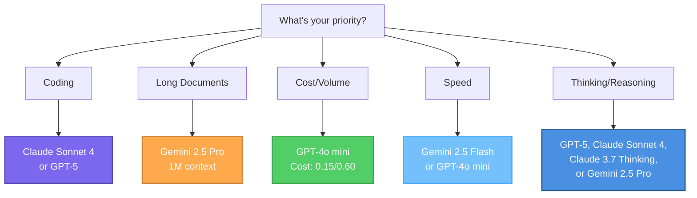

Create specialized AI agents tailored to your workflows. This guide covers agent creation from initial setup through deployment.

<Info>
Building an AI Agent means defining its role, writing instructions, selecting a model, and optionally connecting tools.
</Info>

<Tabs>
<Tab title="Getting Started">

## Agent Creation - Video Explanation

Explore the step-by-step instructions on creating AI agents by video. These two videos visually demonstrates the key decisions and actions you need to build, configure, and deploy your own custom agents.


<AccordionGroup>
<Accordion title="Basic Agent Creation" icon="user" defaultOpen="true">

### Basic Agent:

Watch how to create a basic agent with straightforward instructions. This helps you learning the fundamentals of agent creation.

<Frame>
<video
  controls
  className="w-full aspect-video rounded-xl"
  src="/videos/basic-agent-tutorial.mp4"
  title="Creating a Basic Agent"
>
Your browser does not support the video tag.
</video>
</Frame>

<Tip>
Start with simple agents to understand the core concepts before moving to more complex multi-tool configurations.
</Tip>

</Accordion>

<Accordion title="Tool Connected Agent Creation" icon="screwdriver-wrench">

### Multi-Tool Agent: 

Watch how to create an agent that connects multiple tools to automate workflows. This is a practical example of cross-system integration.

<Frame>
<video
  controls
  className="w-full aspect-video rounded-xl"
  src="/videos/multi-tool-agent-tutorial.mp4"
  title="Creating a Multi-Tool Agent"
>
Your browser does not support the video tag.
</video>
</Frame>

<Tip>
This example demonstrates how agents can connect multiple business systems to automate workflows that typically require manual data transfer.
</Tip>

</Accordion>
</AccordionGroup>


## Agent Creation - Step by Step Explanation

<Steps>
<Step title="Before You Begin">

Define your agent's purpose:
- **What task** will this agent handle?
- **How complex** is the workflow?
- **Which tools** does it need?
</Step>

<Step title="Access Agent Creation">
Navigate to the agent creation interface and click "Create New Agent."

<Frame caption="Agent creation interface">

</Frame>
</Step>

<Step title="Name Your Agent">
Choose a clear, descriptive name that indicates purpose.

**Good:** "Customer Support Assistant," "Q4 Sales Data Analyzer"  
**Avoid:** "Helper," "Agent 1"

<Tip>
If planning organization-wide sharing, choose names that make sense to all users.
</Tip>
</Step>

<Step title="Write Your Instructions">
Instructions specify your agent's role, expertise, tone, and behavior. Write clear, detailed instructions to ensure the agent consistently performs as intended.

### Basic Instructions Guide

<AccordionGroup>
<Accordion title="Role Definition">
State what the agent is and does.

**Example:** "You are a customer support specialist for our SaaS platform. Help users resolve technical issues, answer product questions, and guide them through common workflows."
</Accordion>

<Accordion title="Communication Style">
Define tone and format.

**Example:** "Communicate in a friendly, professional tone. Be concise but thorough. Use bullet points for clarity."
</Accordion>

<Accordion title="Operational Guidelines">
Provide specific rules for how the agent should execute tasks and make decisions.

**Example:** "When analyzing sales data, always compare against the previous quarter and year-over-year metrics. If data is incomplete, note the gaps explicitly rather than making assumptions."
</Accordion>

<Accordion title="Tool Usage Guidelines">
Specify when and how the agent should use available tools.

**Example:** "Use the CRM tool to retrieve customer information before making recommendations. When querying the database, limit results to the last 90 days unless specified otherwise."
</Accordion>

<Accordion title="Business Context">
Include company-specific information.

**Example:** "Support hours: 9 AM-6 PM EST. We offer three tiers: Basic, Pro, Enterprise."
</Accordion>
</AccordionGroup>

<Check>
Clear, detailed instructions are the foundation of agent effectiveness.
</Check>
</Step>

<Step title="Choose an AI Model">
Select the right model based on your agent's task complexity and usage frequency.

### Quick Selection Guide

**For simple, frequent tasks:**
- Use **GPT-4o mini** (most cost-effective) or **Gemini 2.5 Flash** (fast with large context)
- Example tasks: Email drafting, data lookup, simple formatting, high-volume operations

**For complex reasoning:**
- Use **Claude Sonnet 4** or **GPT-5** (advanced capabilities)
- Example tasks: Multi-step analysis, strategic planning, multi-tool usage

**For long context:**
- Use **Gemini 2.5 Pro** (1M context window)
- Example tasks: Document analysis, comprehensive research

<Tip>
Start with a cost-effective model like **GPT-4o mini** for most agents. Upgrade to more capable models (GPT-5, Claude Sonnet 4, or Gemini 2.5 Pro) only if results don't meet your needs.
</Tip>

<Info>
**Need detailed guidance?** See the [Model Selection Guide](#model-selection-guide) in the Advanced Knowledge tab for comprehensive comparisons, pricing, and use case recommendations.
</Info>
</Step>

<Step title="Connect External Softwares (Optional)">
Add MCP connection if your agent needs to interact with external systems.


**Tool selection principles:**
- Only add tools the agent actually needs
- Too many tools can cause selection confusion
- Ensure you have permissions for assigned tools

<Warning>
Agents can only access tools explicitly assigned to them and inherit your personal permissions. See the <a href="/security-governance/access-control#tool-restrictions" target="_blank" rel="noopener">Tool Restrictions</a> section in Access Control for more details.
</Warning>

**Example configurations:**
- **Customer Support:** CRM, ticket system, knowledge base, email
- **Data Analysis:** Database connections, visualization, spreadsheets
- **Content:** Document storage, publishing platform, asset library
</Step>

<Step title="Review and Test">
Test thoroughly before deployment.

**Test:**
- Core functionality with typical requests
- Edge cases and incomplete information
- Error handling when tools fail
- Consistency across multiple similar requests

<Check>
Thorough testing ensures users get reliable results.
</Check>
</Step>

<Step title="Deploy or Share">
**Personal use:** Start using immediately, refine based on real usage

**Organization sharing:** Contact administrator, provide context on purpose and value, await review and approval

<Info>
See [Access Control](/security-governance/access-control) for agent sharing details.
</Info>
</Step>
</Steps>

## Best Practices

<CardGroup cols={2}>
<Card title="Be Explicit" icon="list-check">
Define specific goals, actions and expected results for each step to reduce ambiguity.
</Card>

<Card title="Include Edge Cases" icon="diamond-exclamation">
Anticipate unusual situations and provide handling guidance.
</Card>

<Card title="Provide Context" icon="lightbulb">
Give agents background information about your business processes and terminology.
</Card>

<Card title="Iterate" icon="rotate">
Start simple, test thoroughly, refine based on performance and real world use cases.
</Card>
</CardGroup>

## Common Mistakes

<AccordionGroup>
<Accordion title="Vague Instructions">
**Problem:** "You are a helpful assistant" lacks guidance.  
**Solution:** Be specific about role, expertise, tone, and guidelines.
</Accordion>

<Accordion title="Too Many Responsibilities">
**Problem:** One agent handling unrelated tasks like customer support and data analysis.  
**Solution:** Create focused agents for specific workflows.
</Accordion>

<Accordion title="Tool Overload">
**Problem:** Assigning every available tool.  
**Solution:** Only add necessary tools to avoid selection confusion.
</Accordion>

<Accordion title="Insufficient Testing">
**Problem:** Deploying without thorough testing.  
**Solution:** Test extensively with realistic scenarios first.
</Accordion>
</AccordionGroup>


</Tab>

<Tab title="Advanced Knowledge">

## AI Agent Instruction Crash Course

This guide introduces five key elements that help create more effective agents. While these fundamentals provide a solid starting point, they represent examples of good practices rather than a complete framework. However, building truly reliable agents requires deeper exploration and iteration beyond these basics.

<AccordionGroup>
<Accordion title="1. Persona: Who is your agent?" icon="user">
Define your agent's role, expertise, and perspective to shape response style and depth.

**Example:**
```
You are a senior financial advisor with 20 years of experience 
specializing in retirement planning for conservative investors.
```

<Tip>
**Specific beats generic:** "You are a helpful assistant" provides no guidance. Define expertise, experience level, and specialization.
</Tip>
</Accordion>

<Accordion title="2. Goals: What should it achieve?" icon="bullseye">
Clearly state the objective and desired outcome for every interaction.

**Example:**
```
Your goal is to analyze sales data from the last quarter, 
identify the top 3 declining products, and recommend specific 
actions to reverse the trend. Present findings in a concise 
executive summary format.
```

<Check>
Specific, measurable goals produce consistent, actionable results.
</Check>
</Accordion>

<Accordion title="3. Tools: What can it use?" icon="wrench">
Specify which tools to use and when. Provide clear guidelines for tool selection when multiple options exist.

**Example:**
```
Available tools:
- database_query: Use for all customer data lookups
- crm_api: Use only when database is unavailable
- email_tool: Use for sending notifications

Always query the database before making recommendations.
Never update records without explicit user confirmation.
```

<Warning>
Too many similar tools confuse agents. If your agent struggles with tool selection, provide clearer usage criteria or reduce tool count.
</Warning>
</Accordion>

<Accordion title="4. Constraints: What are the boundaries?" icon="shield-halved">
Set clear boundaries for format, tone, length, permissions, and prohibited actions.

**Example:**
```
Constraints:
- Keep responses under 200 words unless analysis requires detail
- Use professional but friendly tone
- Never make promises about delivery dates
- If customer requests exceed \$500, escalate to human approval
- Format all data tables in markdown
```

<Info>
Constraints prevent common failure modes. Add new constraints as you discover edge cases in production.
</Info>
</Accordion>

<Accordion title="5. Context: What background matters?" icon="book-open">
Provide relevant background information, business rules, and domain-specific knowledge.

**Example:**
```
Company context:
- We serve B2B SaaS customers with 3 pricing tiers
- Standard support hours: 9 AM-6 PM EST, Mon-Fri
- Enterprise customers get priority within 2 hours
- Our refund policy allows 30-day money-back guarantee
- Common abbreviations: ARR (Annual Recurring Revenue), 
  MRR (Monthly Recurring Revenue)
```

<Tip>
Include terminology, acronyms, business rules, and any domain knowledge the agent needs to interpret requests correctly.
</Tip>
</Accordion>
</AccordionGroup>

### Quick Framework

Use this template as your starting point:

```
[PERSONA]
You are a [specific role] with [expertise/experience].

[GOALS]
Your objective is to [primary goal]. Focus on [key outcomes].

[CONTEXT]
Important background: [domain knowledge, business rules, terminology]

[TOOLS]
Available tools: [list]
Use [tool A] when [condition].
Use [tool B] for [scenario].

[CONSTRAINTS]
- Format: [requirements]
- Tone: [style guidelines]
- Never: [prohibited actions]
- Always: [required behaviors]
- Escalate when: [escalation criteria]
```

<CardGroup cols={2}>
<Card title="Start Simple" icon="seedling">
Begin with persona, goal, and constraints. Add complexity only as needed.
</Card>

<Card title="Test Thoroughly" icon="flask">
Run your prompts against edge cases. Refine based on actual failures.
</Card>

<Card title="Iterate" icon="arrows-rotate">
Prompts improve through real usage. Update based on production learnings.
</Card>

<Card title="Learn More" icon="graduation-cap">
Explore more advanced techniques with [OpenAI's](https://platform.openai.com/docs/guides/prompt-engineering), [Anthropic's](https://docs.anthropic.com/en/docs/build-with-claude/prompt-engineering/overview), or even [Google's](https://ai.google.dev/gemini-api/docs/prompting-intro) prompting guides.
</Card>
</CardGroup>

<Info>
**Want deeper knowledge?** Search for "prompt engineering best practices", "AI agent design patterns" and "tool calling strategies" to explore advanced techniques.
</Info>

---

## Model Selection Guide

Quick comparison to help you choose the right model. For detailed specs and benchmarks, visit [OpenAI](https://openai.com), [Anthropic](https://anthropic.com), or [Google DeepMind](https://deepmind.google/technologies/gemini/).

### Model Comparison

<AccordionGroup>
<Accordion title="OpenAI Models" icon="openai">

| Model | Context | Cost (Input/Output) | Best For |
|-------|---------|---------------------|----------|
| **GPT-5** | 400K | \$1.25 / \$10 per 1M | Advanced coding, agentic workflows, thinking mode |
| **GPT-4o** | 128K | \$2.50 / \$10 per 1M | General-purpose, balanced tasks |
| **GPT-4o mini** | 128K | \$0.15 / \$0.60 per 1M | High-volume, cost-sensitive tasks |

**Key Features:** Strong general performance, proven reliability
</Accordion>

<Accordion title="Anthropic (Claude) Models" icon="brain">

| Model | Context | Cost (Input/Output) | Best For |
|-------|---------|---------------------|----------|
| **Claude Sonnet 4** | 200K | \$3 / \$15 per 1M | Advanced coding, thinking mode, reasoning |
| **Claude Sonnet 3.7 Thinking** | 200K | \$3 / \$15 per 1M | Complex planning with optional thinking |
| **Claude Sonnet 3.7** | 200K | \$3 / \$15 per 1M | General tasks, faster responses |

**Key Features:** Industry-leading coding (72.7% SWE-bench), strong reasoning
</Accordion>

<Accordion title="Google (Gemini) Models" icon="google">

| Model | Context | Cost (Input/Output) | Best For |
|-------|---------|---------------------|----------|
| **Gemini 2.5 Pro** | 1M | \$1.25-2.50 / \$10-15 per 1M | Long documents, thinking mode, analysis |
| **Gemini 2.5 Flash** | 1M | \$0.30 / \$2.50 per 1M | Speed, real-time, cost-efficiency |

**Key Features:** Largest context window (1M tokens), optimized for speed and document analysis
</Accordion>
</AccordionGroup>

<Info>
**Thinking Models Available:** GPT-5, Claude Sonnet 4, Claude Sonnet 3.7 Thinking, and Gemini 2.5 Pro all support advanced reasoning and thinking capabilities.
</Info>

### Quick Selection by Task

<AccordionGroup>
<Accordion title="Coding & Development" icon="code">
**Premium:** Claude Sonnet 4 or GPT-5 (thinking mode, large context)  
**Budget:** GPT-4o mini (87.2% HumanEval, \$0.15/\$0.60)

<Check>
Use premium models for production code or complex refactoring. Use GPT-4o mini for scripts and simple tasks.
</Check>
</Accordion>

<Accordion title="Long Documents & Analysis" icon="chart-bar">
**Best:** Gemini 2.5 Pro (1M context, thinking mode)  
**Alternative:** GPT-5 (400K context) or Claude Sonnet 4 (200K context)

<Tip>
Gemini 2.5 Pro handles documents over 200K tokens best. For shorter documents needing deep reasoning, use Claude Sonnet 4 or GPT-5.
</Tip>
</Accordion>

<Accordion title="High-Volume Tasks" icon="bolt">
**Best:** GPT-4o mini (lowest cost at \$0.15/\$0.60)  
**Alternative:** Gemini 2.5 Flash (faster, 1M context, \$0.30/\$2.50)

<Warning>
Cost differences compound quickly at scale. GPT-4o mini can save thousands monthly on high-volume agents.
</Warning>
</Accordion>

<Accordion title="Complex Reasoning & Planning" icon="brain">
**Models with Thinking Mode:** GPT-5, Claude Sonnet 4, Claude Sonnet 3.7 Thinking, Gemini 2.5 Pro

**Choose based on needs:**
- **Long context:** Gemini 2.5 Pro (1M tokens)
- **Best coding:** Claude Sonnet 4 (72.7% SWE-bench)
- **Balanced:** GPT-5 (400K context, 90% caching)
- **Flexible:** Claude Sonnet 3.7 (toggle thinking on/off)

<Info>
Enable thinking mode only for genuinely complex reasoning tasks. For most tasks, standard modes suffice.
</Info>
</Accordion>

<Accordion title="Speed & Real-Time" icon="gauge-high">
**Fast:** Gemini 2.5 Flash (optimized latency, 1M context)  
**Fastest & Cheapest:** GPT-4o mini (lowest cost, great speed)

Real-time chat, live data processing, interactive apps, streaming
</Accordion>
</AccordionGroup>


### Quick Decision Tree



---

## Model Parameters

Fine-tune agent behavior with these parameters. Defaults work for most cases, you should adjust only when needed.

<AccordionGroup>
<Accordion title="Max Context Tokens" icon="inbox">
**What it does:** Maximum input length the model can process (includes your prompt + conversation history)

**When to adjust:**
- Your agent needs to process long documents or extensive conversation history
- Default usually sufficient for most agents

<Tip>
Check your model's context limit: GPT-4o (128K), Claude Sonnet 4 (200K), Gemini 2.5 Pro (1M)
</Tip>
</Accordion>

<Accordion title="Max Output Tokens" icon="message">
**What it does:** Limits how long the agent's responses can be

**Recommended values:**
- **Short responses:** 100-300 tokens (~75-225 words)
- **Standard responses:** 500-1000 tokens (~375-750 words)
- **Long-form content:** 2000+ tokens

<Warning>
Lower values prevent overly verbose responses and reduce costs. Increase only if responses are being cut off.
</Warning>
</Accordion>

<Accordion title="Temperature (0.0-2.0)" icon="temperature-half">
**What it does:** Controls creativity vs consistency in responses

**Recommended values:**
- **0.0-0.3:** Factual tasks, data extraction, precise answers. It produces consistent, predictable, and focused responses
- **0.7-1.2:** Creative writing, brainstorming, varied responses. It generates more creative, diverse, and unpredictable outputs
- **1.0:** Balanced setting with good mix of coherence and creativity for most general-purpose tasks (default)
- **1.5-2.0:** Highly creative/unpredictable (rarely needed)

<Check>
Lower = more predictable and focused. Higher = more creative and diverse.
</Check>
</Accordion>

<Accordion title="Top P (0.0-1.0)" icon="filter">
**What it does:** Alternative to temperature. It limits word choices to most probable options

**Recommended values:**
- **0.1-0.5:** Very focused, consistent outputs
- **0.6-0.8:** Small reduction of diversity
- **0.95-1.0:** Maximum diversity (default)

<Info>
**Important:** Adjust Temperature OR Top P, not both at the same time. Adjusting both simultaneously can produce unexpected results.
</Info>
</Accordion>

<Accordion title="Frequency Penalty (-2.0 to 2.0)" icon="repeat">
**What it does:** Reduces word/phrase repetition based on how often they've already appeared

**Recommended values:**
- **0.0:** No penalty (default, allows natural repetition)
- **0.3-0.7:** Reduces repetitive phrasing
- **1.0-2.0:** Strongly discourages repetition (may affect quality)

**Use when:** Agent repeats the same phrases, words, or sentence structures too often
</Accordion>

<Accordion title="Presence Penalty (-2.0 to 2.0)" icon="lightbulb">
**What it does:** Encourages introducing new topics/concepts rather than staying on current ones

**Recommended values:**
- **0.0:** No penalty (default, natural topic continuation)
- **0.3-0.7:** Encourages topic diversity
- **1.0-2.0:** Strongly pushes for new topics (may lose coherence)

**Use when:** You want comprehensive coverage of multiple aspects or agent gets stuck on one topic
</Accordion>

<Accordion title="Stop Sequences" icon="octagon">
**What it does:** Custom text strings that tell the model to stop generating

**How to use:**
- Add specific phrases like `---`, `END`, or custom markers
- Model stops immediately when it generates any stop sequence
- Useful for structured outputs or preventing unwanted continuation

**Example:** Use `\n\n---\n\n` to stop after completing a section
</Accordion>
</AccordionGroup>

<CardGroup cols={2}>
<Card title="Start with Defaults" icon="circle-check">
Default settings work well for most use cases. Only adjust if you have specific requirements.
</Card>

<Card title="Adjust One at a Time" icon="sliders">
Change one parameter, test, then adjust another. Keep notes on what worked and what didn't
</Card>
</CardGroup>

---

## Security Best Practices

Follow these essential security practices when building agents:

### Limit Tool Access

Only grant tools that are absolutely necessary for the agent's specific task. If your agent drafts emails using Outlook or Gmail, remove the "send email" capability to prevent accidental sends. The agent can prepare drafts while you maintain final control over sending.

<Tip>
Fewer tools mean fewer potential bad behavior risks and more predictable output.
</Tip>

### Isolate Integrations

Avoid connecting systems that shouldn't interact with each other in the same agent. If you have two software systems that should remain separate, don't add both integrations to the same agent. Create separate agents for different domains to maintain clear boundaries.

### Test Iteratively

Begin with minimal permissions and test extensively before expanding capabilities. Avoid deploying agents with full permissions initially. Unexpected behavior is common and should be identified during testing.

**Recommended approach:**
- Begin with read-only access when possible
- Test with non-production data first
- Gradually add tools as you verify behavior
- Monitor agent actions closely during initial deployment

<Warning>
Don't try to build everything in one go. Test incrementally to avoid surprising and unwanted results.
</Warning>

### Implement Safeguards

Add protective measures for sensitive operations:
- Require human confirmation for high-impact actions (Safe Mode)
- Define clear boundaries for agent scope and authority
- Test changes in a staging environment before production deployment

<Info>
See [Security & Governance](/security-governance/security-overview) for comprehensive security practices.
</Info>

</Tab>
</Tabs>
