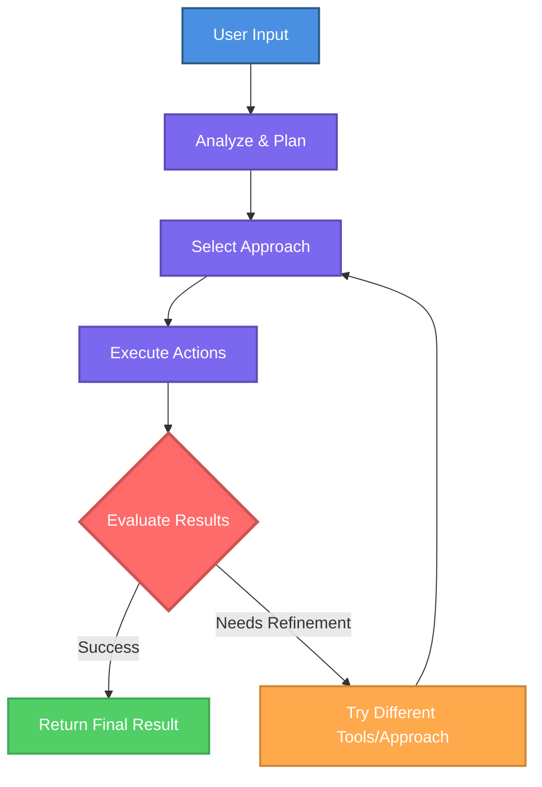

AI agents are specialized AI assistants with persistent instructions and dedicated tool access that deliver consistent, reliable results.

<Info>
Agents are like AI team members with specific roles and expertise. They remember their job across all conversations.
</Info>

---

## How Agents Differ from Regular Chat

<Tabs>
<Tab title="Getting Started">

Regular chat starts fresh each time. Agents have persistent instructions, roles, and tools that apply automatically to every conversation.

**Key advantages:**

<CardGroup cols={2}>
<Card title="Persistent Instructions" icon="file-lines">
Give agents permanent guidelines, roles, and expertise that apply to every conversation automatically.
</Card>

<Card title="Consistent Behavior" icon="equals">
Agents follow the same approach every time, delivering predictable, reliable results across all interactions.
</Card>

<Card title="Dedicated Tools" icon="wrench">
Equip agents with specific external connections (MCP) they'll use automatically when needed for their tasks.
</Card>

<Card title="Specialized Roles" icon="user-tie">
Define agent personalities, tone, and expertise to match specific workflows or team functions.
</Card>
</CardGroup>

<Check>
Configure once, use everywhere. Agents maintain their role and instructions across all conversations.
</Check>

## When to Use Agents

Use agents for:
- **Recurring workflows**: Tasks you perform regularly with consistent requirements
- **Specialized expertise**: Domain-specific knowledge applied consistently  
- **Cross-tool workflows**: Complex tasks spanning multiple systems
- **Team standardization**: Shared workflows across your organization

## Agent Examples

Practical agents you can create for common business workflows:

<AccordionGroup>
<Accordion title="Email Assistant" icon="envelope">
Automatically review your last unread emails, summarize key information, flag urgent messages, and draft responses based on your communication style.

**Tools needed:** Email (Outlook, Gmail)  
**Complexity:** Simple
</Accordion>

<Accordion title="Meeting Scheduler" icon="calendar">
Find available time slots across multiple calendars, schedule meetings with participants, send invitations, and create meeting agendas based on meeting context.

**Tools needed:** Calendar, Email  
**Complexity:** Simple
</Accordion>

<Accordion title="Customer Support Agent" icon="headset">
Handle customer inquiries by accessing your CRM, checking order status, processing refund requests within defined limits, and escalating complex issues to human agents.

**Tools needed:** CRM, Order Management, Email  
**Complexity:** Moderate
</Accordion>

<Accordion title="Data Analysis Agent" icon="chart-line">
Query databases for sales data, perform cohort analysis, identify trends, and generate reports with visualizations based on your reporting standards.

**Tools needed:** Database, Spreadsheet, Visualization tools  
**Complexity:** Moderate
</Accordion>

<Accordion title="Lead Qualification Agent" icon="user-check">
Review new leads from multiple sources, enrich data from public sources, score based on your criteria, assign to appropriate sales team members, and send personalized outreach.

**Tools needed:** CRM, Email, Data enrichment  
**Complexity:** Complex
</Accordion>

<Accordion title="Cross-System Workflow Agent" icon="diagram-project">
Orchestrate processes across multiple systems. For example, retrieve information from Outlook, create records in Odoo, update spreadsheets, and notify teams via messaging platforms.

**Tools needed:** Multiple system integrations  
**Complexity:** Complex
</Accordion>
</AccordionGroup>

<Tip>
Start with simple, single-purpose agents and expand to more complex workflows as you gain experience.
</Tip>

---

## Getting Started with Agents

<CardGroup cols={2}>
  <Card
    title="Finding and Accessing Agents"
    icon="magnifying-glass"
    href="/ai-agents/finding-and-accessing-agents"
  >
    Learn where agents are located and how to access them in WonkaChat.
  </Card>
  <Card
    title="Using Existing Agents"
    icon="play"
    href="/ai-agents/using-existing-agents"
  >
    Start using pre-built agents created by your organization.
  </Card>
  <Card
    title="Creating Your First Agent"
    icon="plus-circle"
    href="/ai-agents/creating-your-first-agent"
  >
    Build your own agent tailored to your specific workflows.
  </Card>
  <Card
    title="Business Teaching"
    icon="graduation-cap"
    href="/ai-agents/business-teaching"
  >
    Provide business context to agents for better, more accurate results.
  </Card>
</CardGroup>

</Tab>

<Tab title="Advanced Knowledge">

## Agent Architecture

Agents are built on several key components that work together to create specialized AI assistants:

<AccordionGroup>
<Accordion title="1. Agent Name" icon="tag">
A clear, descriptive identifier that indicates the agent's purpose and makes it easy to find and select when starting conversations.
</Accordion>

<Accordion title="2. System Prompt (Instructions)" icon="file-lines">
The **system prompt** is the foundational set of instructions that defines your agent's identity and behavior. Unlike regular conversation messages that can be modified or ignored, the system prompt is persistent and authoritative. This prompt shapes every response the agent generates.

**System prompts include:**
- Role definition and expertise areas
- Communication tone and style
- Operational rules and constraints
- Business context and policies
- Decision-making frameworks
- Error handling procedures

The quality of your system prompt directly impacts agent effectiveness. Well-crafted instructions produce consistent, reliable results; vague instructions lead to unpredictable behavior.
</Accordion>

<Accordion title="3. Model Selection" icon="microchip">
The AI model is an important choice that significantly affects both performance and cost. Different models have different capabilities, speed, and pricing.

**Key considerations:**
- **Performance**: More capable models (thinking models) excel at complex reasoning but are more expensive
- **Cost**: Simpler models are cost-effective for straightforward tasks
- **Speed**: Faster models reduce latency for high-frequency interactions
- **Context window**: Determines how much information the agent can process at once

<Warning>
Model selection impacts your agent's quality and operational costs. Match model capability to task complexity: don't overspend on simple tasks or underinvest in complex workflows.
</Warning>

In addition to the model choice, you can adjust **model parameters** that control response randomness, creativity, and repetition. See [Creating Your First Agent](/ai-agents/creating-your-first-agent) for detailed parameter configuration.
</Accordion>

<Accordion title="4. Capabilities" icon="wand-magic-sparkles">
Agents can be equipped with various capabilities beyond text generation:

**Code Execution**: Run code snippets to perform calculations, data transformations, or complex logic operations.

**Web Search**: Access current information from the internet when needed for real-time data or recent events.

**External Connections (MCP)**: The most important capability, direct integration with your business systems through the Model Context Protocol.

Agents dynamically select which tools to use based on the task and their system prompt guidance.

<Info>
**MCP** connects agents to your business systems for real actions.\
See [Tools Connection](/tools-connection/introduction) for setup details.
</Info>

</Accordion>
</AccordionGroup>

## Execution Loop

Agents operate autonomously through a continuous loop, iterating until they achieve the desired result:

<Check>
Agents iterate through multiple approaches and tool combinations until they successfully complete the task or reach defined limits.
</Check>

## Model Selection

WonkaChat supports multiple AI providers, allowing you to choose any model that best fits your needs. Model selection depends on several factors:

- **Task complexity**: More complex reasoning requires more capable models
- **Response speed**: Some models prioritize faster responses
- **Cost considerations**: Model pricing varies significantly across providers

<Info>
For detailed guidance on selecting the right model for your agent, see [Creating Your First Agent](/ai-agents/creating-your-first-agent).
</Info>

## Security and Access Control

### Permission Inheritance

Agents operate within your existing security boundaries. They cannot perform any action you couldn't perform yourself without WonkaChat. If you lack permission to access a system, read a file, or execute an operation manually, the agent cannot bypass those restrictions for your.

<Info>
See [Security & Governance](/security-governance/access-control) for comprehensive security details.
</Info>

</Tab>
</Tabs>
