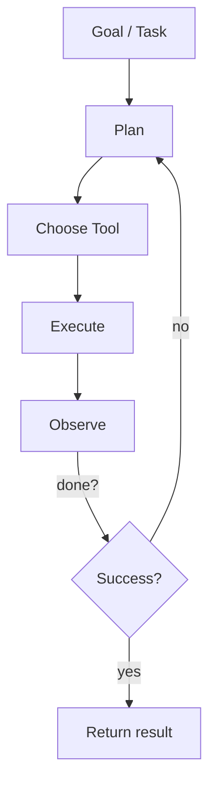

<Frame caption="Agents plan, use tools, and iterate until the goal is met.">

</Frame>

### Definition
An AI agent is a software system that can pursue a goal autonomously by planning steps, calling tools or APIs, observing results, and iterating until the objective is reached.

- **Reasoning**: choose next actions based on goals and observations
- **Tools**: call external capabilities (APIs, databases, browsers)
- **Memory**: recall prior steps and domain knowledge
- **Planning**: decompose objectives into actionable tasks

### Minimal agent loop

### Real-world patterns
- Customer support triage and reply drafting
- Data extraction and report generation
- Operations automations (tickets, CRM updates)

<Tip>
Agents are most effective when constrained with clear goals, curated tools, and guardrails.
</Tip>

### Further reading
- Model Context Protocol (MCP) basics → `/learn/mcp`
- Build a working agent → `/learn/build-agents`

